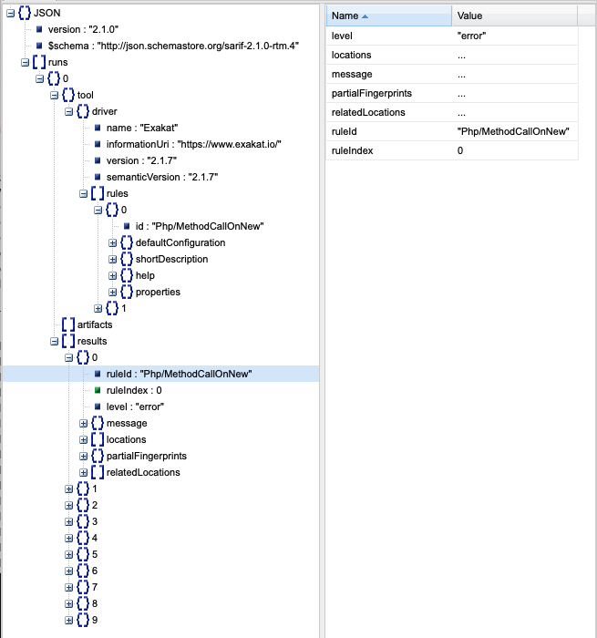

.. reports:

Reports
=======

There are several reports that may be extracted from Exakat : 

* `Diplomat`_
* `Sarif`_
* `Text`_

Configuring a report before the audit
-------------------------------------

By default, Exakat builds the 'Ambassador' report for any project. If you want another report, or want to ignore the build of Ambassador, configure it before running the audit. 

To do so, open the `projects/<project>/config.ini` file, and mention the list of report like that : 

::

    project_reports[] = 'Owasp';
    project_reports[] = 'Weekly';

By configuring the reports before the audit, Exakat processes only the needed analysis, and produces all the reports for each audit. 

Generating a report after the audit
-----------------------------------

If you have run an audit, but wants to extract another report for a piece of code, you can use the following command : 

   `php exakat.phar report -p <project> -format <format> -file <filename>`
   
Where <format> is one of the format listed in the following section, and <filename> is the target file. 

Note that some format requires some specific audits to be run : they will fail if those results are not available. Then, run the audit again, and mention the desired audit in the configuration. 

Common behavior
---------------

Default format is Text. Each report has a default filename, that may be configured with the -file option. Each report adds a file extension to the provided filename. 

A special value for -file is 'stdout'. Some formats may be output to stdout, such as Text or Json. Not all format are accepting that value : some format, like Ambassador or Sqlite, may only be written to directories. 

Each report is stored in its <project> folder, under the requested name.

Reports may be generated at any time, during execution of the analysis (partial results) or later, even if another audit is running. 

Reports descriptions
--------------------

Diplomat
________

The Diplomat is the default human readable report.

The Diplomat report is the default report since Exakat 1.7.0. It is a light version of the Ambassador report, and uses a shorter list of analysis. 

::

    Name,File,Line
    0,/features/bootstrap/FeatureContext.php,61
    10000,/features/bootstrap/FeatureContext.php,61
    777,/features/bootstrap/FeatureContext.php,63
    20,/features/bootstrap/FeatureContext.php,73
    0,/features/bootstrap/FeatureContext.php,334
    0,/features/bootstrap/FeatureContext.php,339
    0,/features/bootstrap/FeatureContext.php,344
    0,/features/bootstrap/FeatureContext.php,362
    0,/features/bootstrap/FeatureContext.php,366
    0,/features/bootstrap/FeatureContext.php,368
    0,/features/bootstrap/FeatureContext.php,372
    777,/features/bootstrap/FeatureContext.php,423
    777,/features/bootstrap/FeatureContext.php,431
    0,/src/Behat/Behat/Context/ContextClass/SimpleClassGenerator.php,68
    1,/src/Behat/Behat/Context/ContextClass/SimpleClassGenerator.php,69
    0,/src/Behat/Behat/Context/Environment/InitializedContextEnvironment.php,84
    0,/src/Behat/Behat/Context/Environment/InitializedContextEnvironment.php,150
    

Diplomat is a HTML report format.

Diplomat depends on the following 15 themes : CompatibilityPHP53, CompatibilityPHP54, CompatibilityPHP55, CompatibilityPHP56, CompatibilityPHP70, CompatibilityPHP71, CompatibilityPHP72, CompatibilityPHP73, CompatibilityPHP74, CompatibilityPHP80, Top10, Preferences, Appinfo, Appcontent, Suggestions.

Sarif
_____

The SARIF report publishes the results in SARIF format.

`Static Analysis Results Interchange Format (SARIF) <https://docs.oasis-open.org/sarif/sarif/v2.0/sarif-v2.0.html>`_  a standard format for the output of static analysis tools. The format is referred to as the “Static Analysis Results Interchange Format” and is abbreviated as SARIF. 

SARIF is a flexible JSON format, that describes in details the rules, the issues and their context.

More details are available at `sarifweb <https://sarifweb.azurewebsites.net/>`_ and `SARIF support for code scanning <https://docs.github.com/en/github/finding-security-vulnerabilities-and-errors-in-your-code/sarif-support-for-code-scanning>`_ at Github.

Sarif is a Json report format.

Sarif accepts any arbitrary list of results.

Text
____

The Text report is a very simple text format.

The Text report displays one result per line, with the following format  : 

::
    
   /path/from/project/root/to/file:line[space]name of analysis
   
   
This format is fast, and fitted for machine communications.

::

    /classes/test.php:1002	Php/ShouldUseFunction	Should Use Function	array_values(array_unique(array_merge($classTags, $annotations['tags'])))
    /classes/test.php:1002	Php/ShouldUseFunction	Should Use Function	array_merge($classTags, $annotations['tags'])
    /classes/test.php:1005	Structures/NoArrayUnique	Avoid array_unique()	array_unique(array_merge($classTags, $this->testMethods[$testMethodName]['tags']))
    /classes/test.php:1005	Performances/SlowFunctions	Slow Functions	array_unique(array_merge($classTags, $this->testMethods[$testMethodName]['tags']))
    

Text is a Text report format.

Text accepts any arbitrary list of results.

